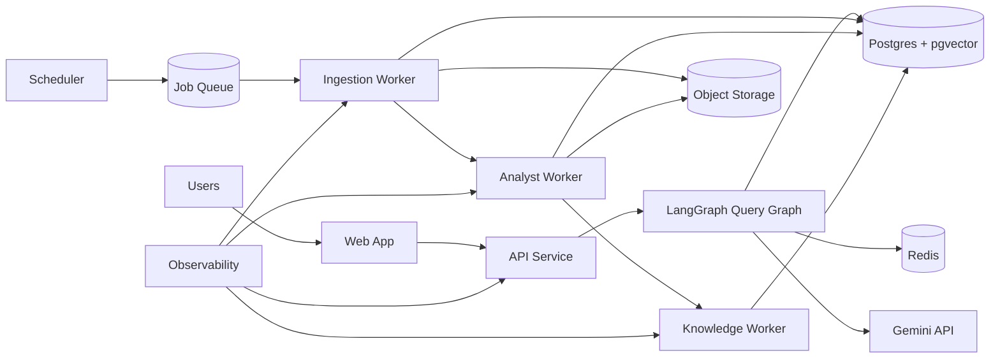

# Production Architecture (500-1000 Users)

## 1. Scope and Assumptions

- Target users: 500-1000 total users, read-heavy product usage.
- Peak concurrent users: 50-150 (assumption for initial sizing).
- Workload split:
  - Continuous background ingestion and analysis of filings.
  - Interactive query traffic (low latency) from dashboard/API.
- Reliability target: no data loss in ingestion pipeline, graceful degradation for LLM/provider failures.

## 2. Product Packaging Recommendation

Package as three deployable services + shared data layer:

1. `gravity-api` (Query/API service)
- Stateless FastAPI service.
- Handles authn/authz, watchlists, query requests.
- Calls synthesis/query graph with strict timeouts.

2. `gravity-workers` (Background processing)
- Runs ingestion, analyst, knowledge indexing flows.
- Pulls jobs from queue.
- Uses idempotency keys (`accession_number`) and dead-letter queue.

3. `gravity-web` (Frontend)
- Streamlit is fine for internal pilot.
- For product launch: move to a dedicated web client (Next.js/React) against `gravity-api`.

4. Shared data layer
- Postgres: metadata, state, checkpoints, tenancy.
- Redis: queue, distributed locks, rate limits, short-lived cache.
- Vector store: start with Postgres + pgvector (simpler ops at this scale).
- Object storage: raw filing artifacts and derived blobs.

## 3. Recommended Runtime Architecture

### Why this is the best fit for 500-1000 users

- Separates low-latency reads from long-running ingestion jobs.
- Keeps compute elastic while protecting user-facing latency.
- Minimizes operational complexity by consolidating data on Postgres + pgvector first.
- Preserves compatibility with your existing LangGraph node model.

## 4. Deployment Topology (Initial)

- Region: single region, multi-AZ.
- Compute:
  - `gravity-api`: 3 replicas (HPA enabled).
  - `gravity-workers`: 3-6 replicas depending on queue lag.
  - `gravity-web`: 2 replicas.
- Data:
  - Managed Postgres (HA) + pgvector extension.
  - Managed Redis with persistence (AOF enabled).
  - Managed object storage.

## 5. Processing and Data Flow

### 5.1 Ingestion
1. Scheduler emits ticker jobs every N minutes.
2. Worker fetches filings from SEC and attachments.
3. Idempotency check in Postgres on `accession_number`.
4. Raw normalized text stored in object storage + metadata row in Postgres.

### 5.2 Analysis
1. Worker executes analyst graph with deterministic `thread_id` per filing.
2. LLM extraction validates schema.
3. On invalid output: single reflection retry, then dead-letter.
4. Persist structured output + processing status.

### 5.3 Indexing
1. Chunk structured + narrative data.
2. Upsert embeddings and lexical fields.
3. Refresh BM25 representation.
4. Mark filing `ANALYZED` / `ANALYZED_NOT_INDEXED`.

### 5.4 Query
1. API receives question + optional watchlist context.
2. Query graph runs hybrid retrieval (semantic + lexical + RRF).
3. Synthesis model produces grounded answer with citations.
4. Response logged with trace id and latency metrics.

## 6. Scaling and SLO Controls

- Autoscale API on CPU + p95 latency.
- Autoscale workers on queue depth + job age.
- Backpressure:
  - Queue max depth thresholds.
  - Per-tenant and global LLM rate limits.
- Suggested starting SLOs:
  - Query p95 < 3s (without cold start).
  - Filing-to-index freshness < 10 minutes for standard forms.
  - Job success rate > 99% excluding provider outages.

## 7. Reliability Patterns (Required)

- Idempotent writes for every stage.
- Dead-letter queue + replay tool.
- Retries with jittered exponential backoff.
- Circuit breaker around LLM/provider APIs.
- End-to-end tracing (request id propagated through all nodes).

## 8. Security and Compliance Baseline

- Secrets in secret manager only.
- Row-level tenant scoping in query path.
- Encrypt data in transit and at rest.
- Audit log for analyst outputs and user queries.

## 9. What to Change in Current Codebase First

1. Replace local SQLite state/checkpoints with Postgres-backed adapters.
2. Move ingestion from in-process thread loop to queue-driven workers.
3. Split `main.py` runtime into:
   - API app process
   - worker process
4. Keep LangGraph node logic; wrap each graph invocation in durable job handlers.
5. Replace local-only RAG persistence with Postgres + pgvector storage adapters.

## 10. "Best Way" Review of Current Approach

Current implementation is a strong prototype but not the best production packaging yet.

What is good:
- LangGraph orchestration and node decomposition.
- Structured state transitions.
- Hybrid retrieval direction.

What must change for 500-1000 users:
- In-process thread architecture is not sufficient for operability and horizontal scaling.
- SQLite is not suitable as primary multi-writer production store.
- Background processing must be queue-based with dead-letter/replay.
- Strict extraction schema handling needs guardrails for partial-valid outputs.

## 11. Primary Sources Used

- LangGraph production scaling and worker concurrency guidance: https://docs.langchain.com/langsmith/deploy-self-hosted-agent-chat
- LangGraph persistence and production checkpointer pattern: https://docs.langchain.com/oss/python/langgraph/add-memory
- LangGraph Postgres checkpointer package: https://pypi.org/project/langgraph-checkpoint-postgres/
- FastAPI deployment guidance (single Uvicorn process per container on Kubernetes): https://fastapi.tiangolo.com/deployment/server-workers/
- Kubernetes horizontal pod autoscaling behavior: https://kubernetes.io/docs/concepts/workloads/autoscaling/horizontal-pod-autoscale/
- SQLite concurrency limitation (single writer): https://sqlite.org/wal.html
- SQLAlchemy connection pooling behavior/tuning: https://docs.sqlalchemy.org/en/20/core/pooling.html
- Redis persistence (AOF / RDB): https://redis.io/docs/latest/operate/oss_and_stack/management/persistence/
- Chroma production client modes (PersistentClient vs HttpClient): https://docs.trychroma.com/docs/run-chroma/persistent-client
- pgvector indexing and ANN options (HNSW/IVFFlat): https://github.com/pgvector/pgvector
- Python release lifecycle (3.9 lifecycle context): https://devguide.python.org/versions/
